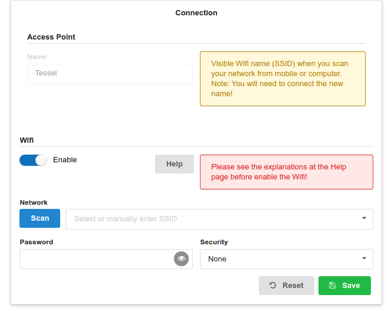

# Tessel Network Example



## Install Requirements

```
npm i -g t2-cli bower
npm i
bower install
```


## Run at Tessel

```
t2 run index.js --compress=false
```
Open http://Tessel_IP/. You can find Tessel_IP either looking at your DHCP provider (for ex modem), or with a network scanner like [fing](https://www.fing.io/).

**Note** : You may lost Tessel connection after running the command. Which will changed according to
`database/configuration.json` file.


## Run at development machine

```
PORT=3000 node index.js
```
Open http://localhost:3000/


## Deploy to Tessel

```
t2 push index.js
```
